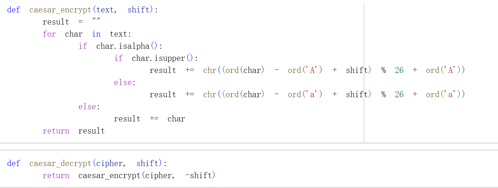

# Цель работы

Продемонстрировать реализацию шифров простой замены на языке Python.

В данной работе были реализованы два классических шифра:
- шифр Цезаря
- шифр Атбаш

# Реализация шифра Цезаря

## Принцип работы

Шифр Цезаря — это шифр сдвига, где каждая буква открытого текста заменяется на букву, стоящую на определённое количество позиций дальше в алфавите.

Для выполнения задания были реализованы функции шифрования и дешифрования, которые обрабатывают как заглавные, так и строчные буквы, сохраняя небуквенные символы без изменений.

## Код программы

## Результат выполнения

Для проверки корректности работы были использованы примеры из задания:
- Фраза Юлия Цезаря «Veni, vidi, vici» со сдвигом 3
- Фраза императора Августа «Festina lente» со сдвигом 1

Как видно на экране, программа успешно шифрует и расшифровывает текст, возвращая исходное сообщение.

# Реализация шифра Атбаш

## Принцип работы

Шифр Атбаш — это простой шифр подстановки, где первая буква алфавита заменяется последней, вторая — предпоследней и так далее (A ↔ Z, B ↔ Y и т.д.).

Данный шифр является симметричным: процедуры шифрования и дешифрования идентичны.

## Код программы

## Результат выполнения

Для проверки был использован пример из задания: преобразование «ABC XYZ» в «ZYX CBA» и обратно.

Результат подтверждает, что двукратное применение шифра возвращает исходный текст, что доказывает его симметричность.

# Вывод

В ходе выполнения лабораторной работы были успешно реализованы два алгоритма простой замены:
- шифр Цезаря с произвольным ключом сдвига
- шифр Атбаш с зеркальной подстановкой

Все алгоритмы протестированы на примерах из задания и работают корректно.