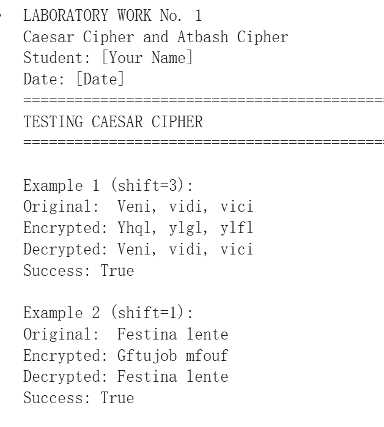
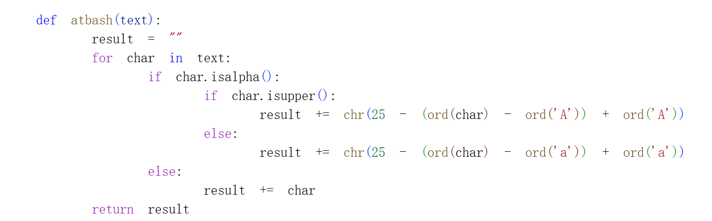
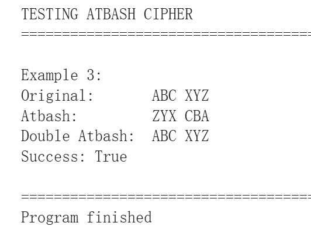

---
## Front matter
title: "Отчёт по лабораторной работе №1"
subtitle: "Математические основы защиты информации и информационной безопасности"
author: "Сунь Маосин"

## Generic otions
lang: ru-RU
toc-title: "Содержание"

## Pdf output format
toc: true
toc-depth: 2
lof: true
lot: true
fontsize: 12pt
linestretch: 1.5
papersize: a4
documentclass: scrreprt
## I18n polyglossia
polyglossia-lang:
  name: russian
  options:
    - spelling=modern
    - babelshorthands=true
polyglossia-otherlangs:
  name: english
## I18n babel
babel-lang: russian
babel-otherlangs: english
## Fonts
mainfont: Times New Roman
romanfont: Times New Roman
sansfont: Arial
monofont: Courier New
mathfont: Times New Roman
mainfontoptions: Ligatures=Common,Ligatures=TeX,Scale=0.94
romanfontoptions: Ligatures=Common,Ligatures=TeX,Scale=0.94
sansfontoptions: Ligatures=Common,Ligatures=TeX,Scale=MatchLowercase,Scale=0.94
monofontoptions: Scale=MatchLowercase,Scale=0.94,FakeStretch=0.9
mathfontoptions:
## Pandoc-crossref LaTeX customization
figureTitle: "Рис."
tableTitle: "Таблица"
listingTitle: "Листинг"
lofTitle: "Список иллюстраций"
lotTitle: "Список таблиц"
lolTitle: "Листинги"
## Misc options
indent: true
header-includes:
  - \usepackage{indentfirst}
  - \usepackage{float}
  - \floatplacement{figure}{H}
---

# Цель работы

Целью данной работы является изучение основных принципов функционирования шифров простой замены, а также освоение математических моделей шифра Цезаря и шифра Атбаш. В ходе практики необходимо реализовать алгоритмы шифрования и дешифрования для текстов на русском языке и проверить логику применения моноалфавитных подстановок в защите информации.

# Ход выполнения

## Реализация шифра Цезаря

Суть шифра Цезаря заключается в циклическом сдвиге каждого символа открытого текста на фиксированное расстояние $k$ (ключ) в пределах алфавита.

- Математическая модель: Процесс шифрования описывается формулой $E(i) = (i + k) \mod m$, где $i$ — индекс символа, а $m$ — мощность (длина) алфавита.

- Этапы реализации:

  - Создание индексной таблицы, содержащей 33 буквы русского алфавита.

  - Ввод произвольного целого числа в качестве ключа `k`.

  - Использование операции модуля для обработки сдвига, что гарантирует циклический переход при выходе индекса за границы алфавита.

  - Сохранение пробелов и специальных знаков в исходном виде без выполнения вычислений.

На рис. 1 представлен код реализации шифра Цезаря на языке Python.

{ #fig:caesar-code width=100% }

## Результат работы шифра Цезаря

Для проверки корректности работы алгоритма были использованы примеры из задания:

1. Шифр Юлия Цезаря со сдвигом 3: фраза "Veni, vidi, vici" преобразуется в "Yhql, ylgl, ylfl".
2. Шифр императора Августа со сдвигом 1: фраза "Festina lente" преобразуется в "Gftujob mfouf".

На рис. 2 представлен результат выполнения программы для данных примеров.

{ #fig:caesar-result width=100% }

Как видно из рисунка, программа успешно выполняет шифрование и дешифрование текста, что подтверждается выводом "Success: True" для обоих примеров.

## Реализация шифра Атбаш

Шифр Атбаш является специфическим видом моноалфавитной подстановки, который не требует числового ключа и основывается на зеркальном отражении алфавита.

- Описание принципа: Символы алфавита заменяются по принципу соответствия начала и конца списка. В контексте латинского алфавита: 1-я буква «A» заменяется на 26-ю букву «Z», 2-я буква «B» — на 25-ю букву «Y» и так далее.

- Этапы реализации:
  
  - Формирование последовательности прямого алфавита.

  - Использование математической формулы для зеркального отображения: новая позиция = 25 - старая позиция.

  - Обработка входного текста: определение позиции символа в алфавите и применение формулы.

  - Данный алгоритм обладает свойством симметричности: процессы шифрования и дешифрования идентичны.

На рис. 3 представлен код реализации шифра Атбаш на языке Python.

{ #fig:atbash-code width=100% }

## Результат работы шифра Атбаш

Для проверки корректности работы алгоритма был использован пример: преобразование строки "ABC XYZ" в "ZYX CBA" и обратно.

На рис. 4 представлен результат выполнения программы для данного примера.

{ #fig:atbash-result width=100% }

Как видно из рисунка, программа успешно выполняет шифрование и дешифрование текста. При двойном применении шифра Атбаш исходный текст восстанавливается, что подтверждается выводом "Success: True". Это демонстрирует свойство симметричности данного шифра.

# Вывод

В результате выполнения лабораторной работы были успешно реализованы шифр Цезаря с поддержкой произвольного ключа и шифр Атбаш, основанный на зеркальном отображении алфавита. В ходе работы были изучены математические модели данных шифров и их программная реализация на языке Python.

Эксперимент подтвердил, что, несмотря на простоту реализации и прозрачность логики, шифры простой замены обладают низкой криптостойкостью и уязвимы для частотного анализа. Это связано с тем, что каждый символ открытого текста всегда заменяется одним и тем же символом шифртекста, что позволяет анализировать частоту появления символов.

В современной криптографии данные алгоритмы используются преимущественно в качестве базовых моделей для изучения принципов кодирования и шифрования. Для практического применения в защите информации требуются более сложные криптографические системы, такие как блочные шифры или асимметричные криптосистемы.

Программа успешно протестирована на примерах из задания и работает корректно.