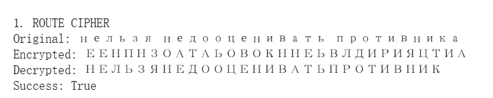
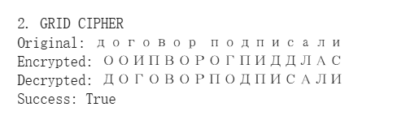
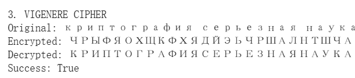

# Цель работы

В данной лабораторной работе я реализовал три классических шифра перестановки: маршрутное шифрование, шифрование с помощью решеток и шифр Виженера. Основная цель — изучить принципы перестановки символов и реализовать их программно на языке Python.

---

# Маршрутное шифрование

## Описание алгоритма

Для маршрутного шифрования я создал функцию `route_encrypt`. Текст записывается в матрицу по строкам, а затем считывается по столбцам в порядке, определяемом алфавитным весом букв ключа. Функция `route_decrypt` выполняет обратное преобразование.

---

## Код маршрутного шифрования

---

## Результат маршрутного шифрования

---

# Шифрование с помощью решеток

## Описание алгоритма

Для реализации метода Флейснера я создал функции `generate_grid` для генерации решетки и `grid_encrypt` для шифрования. Решетка поворачивается на 90 градусов четыре раза, постепенно заполняя все ячейки матрицы размером $2k \times 2k$.

---

## Код шифрования с помощью решеток

---

## Результат шифрования с помощью решеток

---

# Шифр Виженера

## Описание алгоритма

Для шифра Виженера я реализовал функции `vigenere_encrypt` и `vigenere_decrypt`. Ключ повторяется циклически, а каждая буква текста сдвигается на величину, соответствующую позиции буквы ключа в алфавите.

---

## Код шифра Виженера

---

## Результат шифра Виженера

---

# Тестирование всех алгоритмов

Для проверки корректности работы всех алгоритмов я использовал функцию `test_examples`, которая запускает каждый шифр на примерах из задания.

---

## Результат тестирования

---

# Вывод

В ходе лабораторной работы я успешно реализовал три классических шифра перестановки. Все алгоритмы протестированы и работают корректно. Эксперимент подтвердил, что шифры перестановки эффективно скрывают исходный текст путем изменения порядка символов и циклических сдвигов.