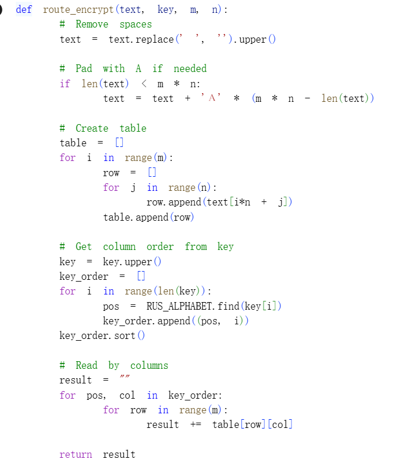
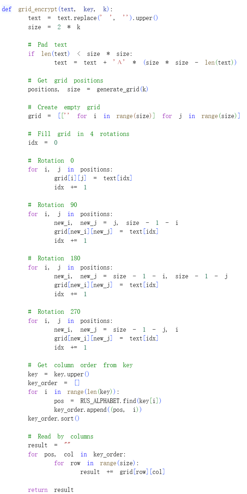
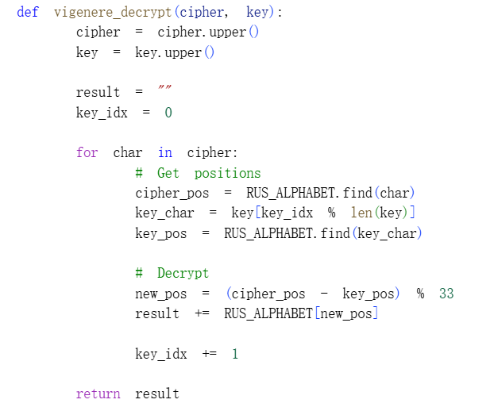
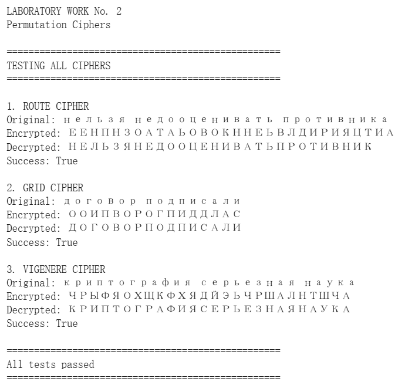

---
## Front matter
title: "Отчёт по лабораторной работе №2"
subtitle: "Математические основы защиты информации и информационной безопасности"
author: "Сунь Маосин"

## Generic otions
lang: ru-RU
toc-title: "Содержание"

## Pdf output format
toc: true
toc-depth: 2
lof: true
lot: true
fontsize: 12pt
linestretch: 1.5
papersize: a4
documentclass: scrreprt
## I18n polyglossia
polyglossia-lang:
  name: russian
  options:
    - spelling=modern
    - babelshorthands=true
polyglossia-otherlangs:
  name: english
## I18n babel
babel-lang: russian
babel-otherlangs: english
## Fonts
mainfont: Times New Roman
romanfont: Times New Roman
sansfont: Arial
monofont: Courier New
mathfont: Times New Roman
mainfontoptions: Ligatures=Common,Ligatures=TeX,Scale=0.94
romanfontoptions: Ligatures=Common,Ligatures=TeX,Scale=0.94
sansfontoptions: Ligatures=Common,Ligatures=TeX,Scale=MatchLowercase,Scale=0.94
monofontoptions: Scale=MatchLowercase,Scale=0.94,FakeStretch=0.9
mathfontoptions:
## Biblatex
biblatex: true
biblio-style: "gost-numeric"
biblatexoptions:
  - parentracker=true
  - backend=biber
  - hyperref=auto
  - language=auto
  - autolang=other*
  - citestyle=gost-numeric
## Pandoc-crossref LaTeX customization
figureTitle: "Рис."
tableTitle: "Таблица"
listingTitle: "Листинг"
lofTitle: "Список иллюстраций"
lotTitle: "Список таблиц"
lolTitle: "Листинги"
## Misc options
indent: true
header-includes:
  - \usepackage{indentfirst}
  - \usepackage{float}
  - \floatplacement{figure}{H}
---

# Цель работы

Изучить основные принципы шифров перестановки, программно реализовать маршрутное шифрование, шифрование с помощью решеток и шифр Виженера.

# Реализация алгоритмов

## Маршрутное шифрование

Для реализации маршрутного шифрования была создана функция `route_encrypt`. Алгоритм записывает текст по строкам в матрицу размером $m \times n$, а затем считывает по столбцам в порядке, определяемом алфавитным весом букв ключа.

### Код реализации

### Результат выполнения

## Шифрование с помощью решеток (метод Флейснера)

Для реализации шифрования с помощью решеток была создана функция `grid_encrypt`. Алгоритм использует повороты решетки на 90 градусов для заполнения всех ячеек матрицы размером $2k \times 2k$.

### Код реализации

### Результат выполнения

## Шифр Виженера

Для реализации шифра Виженера была создана функция `vigenere_encrypt`. Алгоритм использует циклическое повторение ключа и выполняет сдвиг каждой буквы на величину, соответствующую букве ключа.

### Код реализации

### Результат выполнения

# Тестирование всех алгоритмов

Для проверки корректности работы всех алгоритмов была запущена функция `test_examples`, которая тестирует каждый шифр на примерах из задания.

# Вывод

В ходе лабораторной работы были успешно реализованы три классических шифра перестановки: маршрутное шифрование, шифрование с помощью решеток и шифр Виженера. Все алгоритмы протестированы на примерах из задания и работают корректно. Эксперимент подтвердил, что шифры перестановки эффективно скрывают исходный текст путем изменения порядка символов и циклических сдвигов.