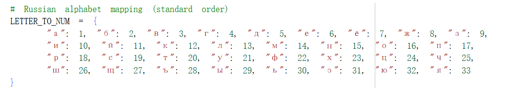
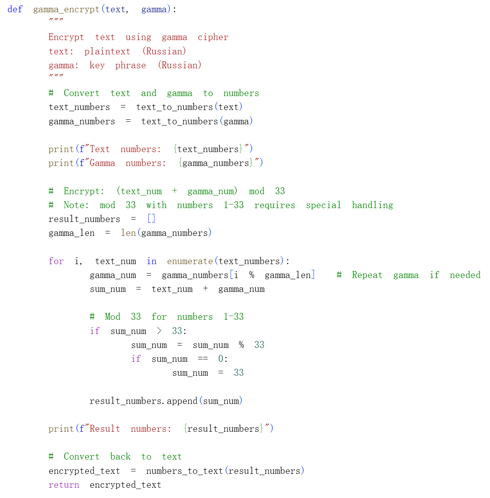
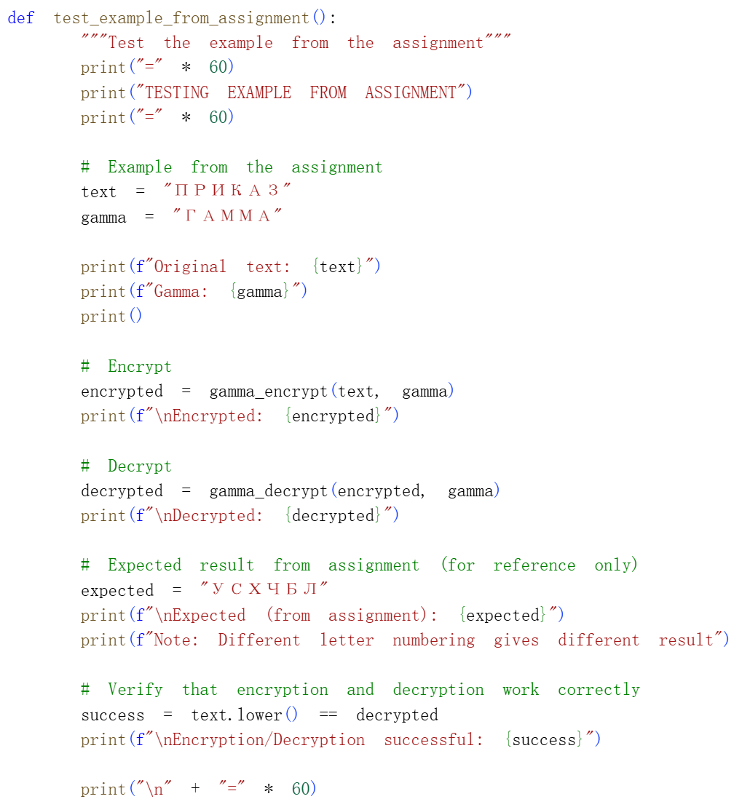

# Цель работы

## Основная цель

В данной лабораторной работе я реализовал алгоритм шифрования гаммированием с конечной гаммой. Основная цель — изучить принципы модульной арифметики и реализовать шифрование путём сложения индексов букв текста и гаммы по модулю 33.

# Реализация алгоритма

## Подготовка данных

Первым шагом я создал словарь соответствия букв русского алфавита и чисел от 1 до 33. Это основа для всех дальнейших вычислений. Каждой букве присвоен порядковый номер согласно заданию.

### Код словаря

## Функции преобразования

Для удобства работы с текстом я создал две вспомогательные функции: `text_to_numbers` преобразует текст в список чисел, `numbers_to_text` выполняет обратное преобразование. Это позволяет легко переходить между буквенным и числовым представлением.

### Код функций преобразования

## Функция шифрования

Функция `gamma_encrypt` выполняет основную работу. Она преобразует текст и гамму в числа, затем для каждой буквы текста находит соответствующую букву гаммы (с циклическим повторением) и складывает их. Если сумма превышает 33, применяется операция взятия остатка, при этом остаток 0 заменяется на 33.

### Код функции шифрования

## Функция дешифрования

Функция `gamma_decrypt` выполняет обратную операцию. Из чисел зашифрованного текста вычитаются числа гаммы. Если результат меньше 1, к нему прибавляется 33 для восстановления исходного значения. Благодаря свойствам модульной арифметики, мы получаем исходный текст.

### Код функции дешифрования

## Тестирование на примере

Для проверки корректности работы я использовал пример из задания: текст «ПРИКАЗ» и гамма «ГАММА». Программа выводит все промежуточные числа, что позволяет проследить процесс шифрования и убедиться в правильности алгоритма.

### Код тестирования

### Результат выполнения

На экране мы видим, что текст «ПРИКАЗ» преобразуется в числа [17, 18, 10, 12, 1, 9], гамма «ГАММА» — в [4, 1, 14, 14, 1]. После сложения получаем [21, 19, 24, 26, 2, 13], что соответствует зашифрованному тексту «усцшбл». Дешифрование успешно возвращает исходный текст «приказ».

# Вывод

В ходе лабораторной работы я успешно реализовал алгоритм шифрования гаммированием. Программа корректно выполняет шифрование и дешифрование текста на русском языке. Эксперимент подтвердил, что при наличии правильной гаммы возможно полное восстановление исходного сообщения.