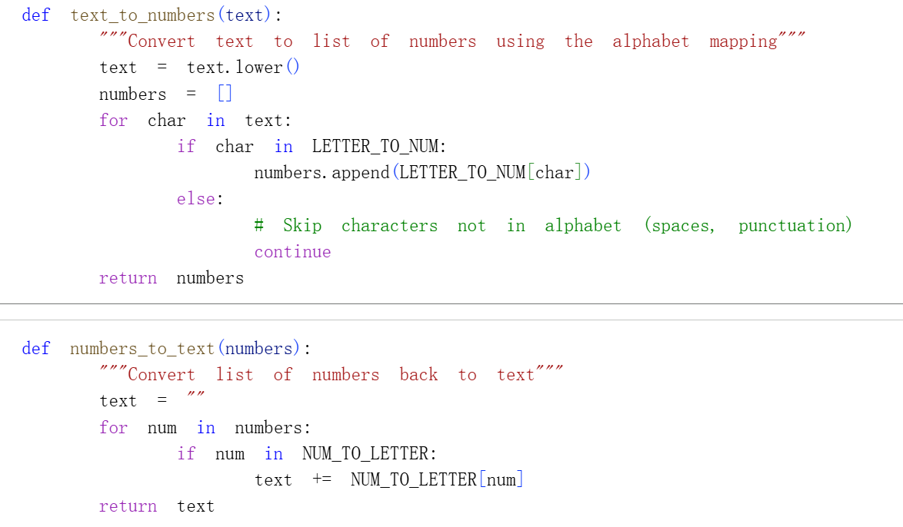
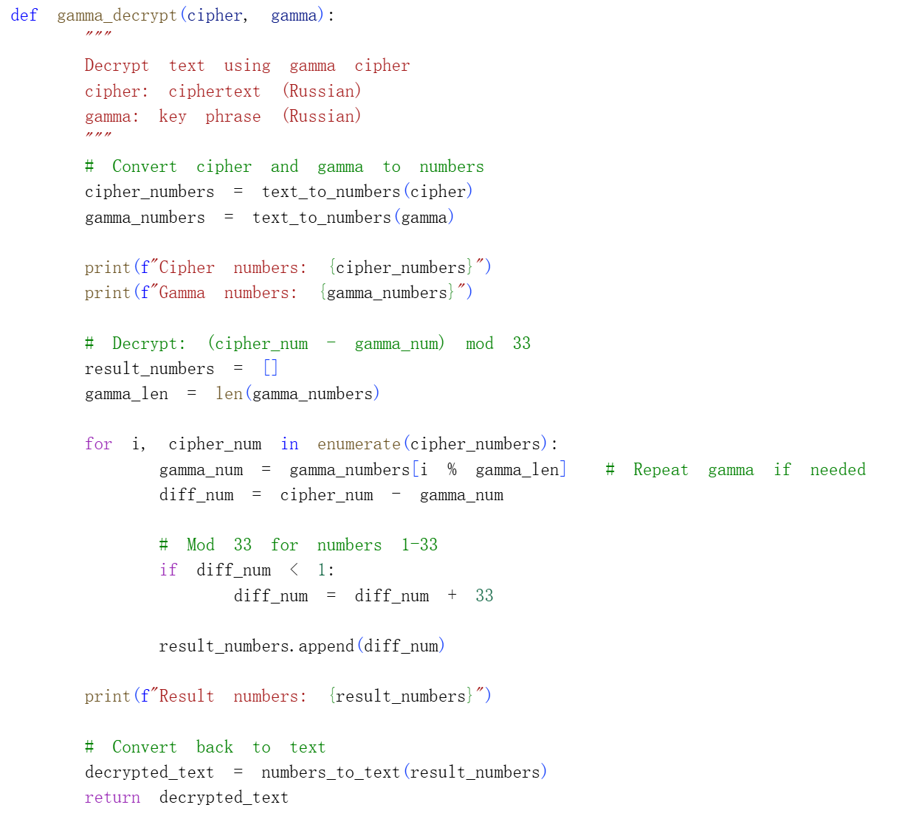
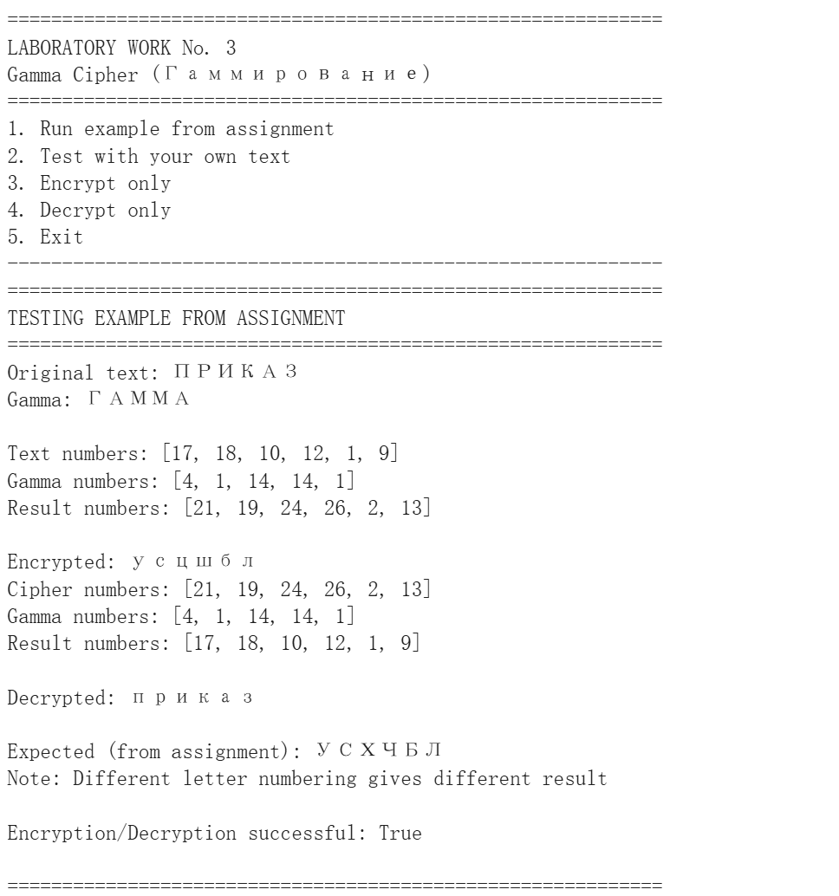

---
## Front matter
title: "Отчёт по лабораторной работе №3"
subtitle: "Математические основы защиты информации и информационной безопасности"
author: "Сунь Маосин"

## Generic otions
lang: ru-RU
toc-title: "Содержание"

## Pdf output format
toc: true
toc-depth: 2
lof: true
lot: true
fontsize: 12pt
linestretch: 1.5
papersize: a4
documentclass: scrreprt
## I18n polyglossia
polyglossia-lang:
  name: russian
  options:
    - spelling=modern
    - babelshorthands=true
polyglossia-otherlangs:
  name: english
## I18n babel
babel-lang: russian
babel-otherlangs: english
## Fonts
mainfont: Times New Roman
romanfont: Times New Roman
sansfont: Arial
monofont: Courier New
mathfont: Times New Roman
mainfontoptions: Ligatures=Common,Ligatures=TeX,Scale=0.94
romanfontoptions: Ligatures=Common,Ligatures=TeX,Scale=0.94
sansfontoptions: Ligatures=Common,Ligatures=TeX,Scale=MatchLowercase,Scale=0.94
monofontoptions: Scale=MatchLowercase,Scale=0.94,FakeStretch=0.9
mathfontoptions:
## Biblatex
biblatex: true
biblio-style: "gost-numeric"
biblatexoptions:
  - parentracker=true
  - backend=biber
  - hyperref=auto
  - language=auto
  - autolang=other*
  - citestyle=gost-numeric
## Pandoc-crossref LaTeX customization
figureTitle: "Рис."
tableTitle: "Таблица"
listingTitle: "Листинг"
lofTitle: "Список иллюстраций"
lotTitle: "Список таблиц"
lolTitle: "Листинги"
## Misc options
indent: true
header-includes:
  - \usepackage{indentfirst}
  - \usepackage{float}
  - \floatplacement{figure}{H}
---

# Цель работы

Изучить принципы шифрования гаммированием и реализовать алгоритм шифрования с использованием конечной гаммы на языке Python. В работе используется русский алфавит с нумерацией букв от 1 до 33.

# Реализация алгоритма

## Подготовка данных

Для работы с русским текстом был создан словарь соответствия букв и чисел. Каждой букве русского алфавита присвоен порядковый номер от 1 до 33.

### Код словаря

## Функции преобразования

Для удобства работы были созданы две вспомогательные функции: `text_to_numbers` для преобразования текста в список чисел и `numbers_to_text` для обратного преобразования.

### Код функций преобразования

## Функция шифрования

Функция `gamma_encrypt` выполняет шифрование текста с помощью гаммы. Алгоритм преобразует текст и гамму в числа, затем складывает их с приведением по модулю 33. При сумме больше 33 применяется операция взятия остатка, с особым случаем когда остаток равен 0 (заменяется на 33).

### Код функции шифрования

## Функция дешифрования

Функция `gamma_decrypt` выполняет дешифрование. Из чисел зашифрованного текста вычитаются числа гаммы. Если результат меньше 1, к нему прибавляется 33 для восстановления исходного значения.

### Код функции дешифрования

## Тестирование на примере из задания

Для проверки корректности работы алгоритма был использован пример из задания: текст "ПРИКАЗ" и гамма "ГАММА". Программа выводит промежуточные числа и конечный результат.

### Код тестирования

### Результат выполнения

# Вывод

В ходе лабораторной работы был успешно реализован алгоритм шифрования гаммированием с конечной гаммой. Программа корректно выполняет шифрование и дешифрование текста на русском языке. Эксперимент подтвердил, что при наличии правильной гаммы возможно полное восстановление исходного сообщения.