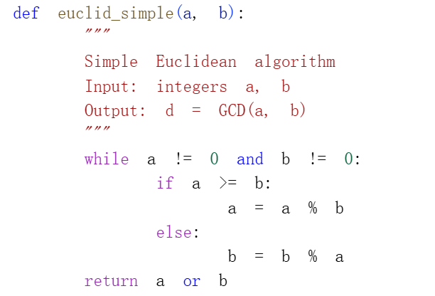
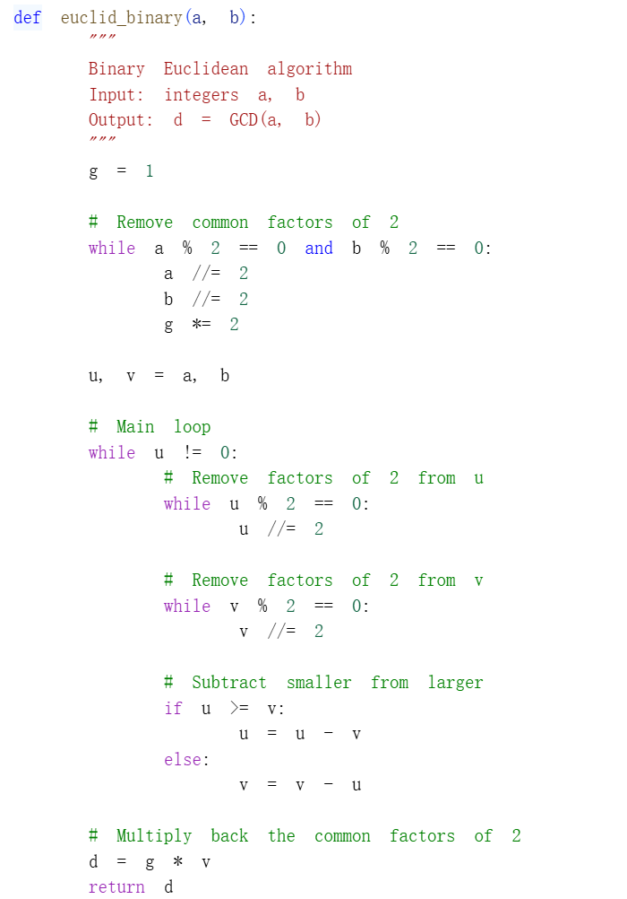
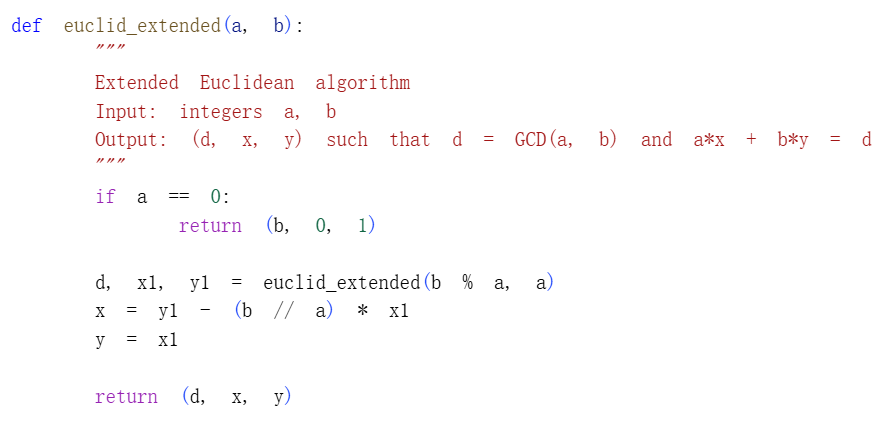
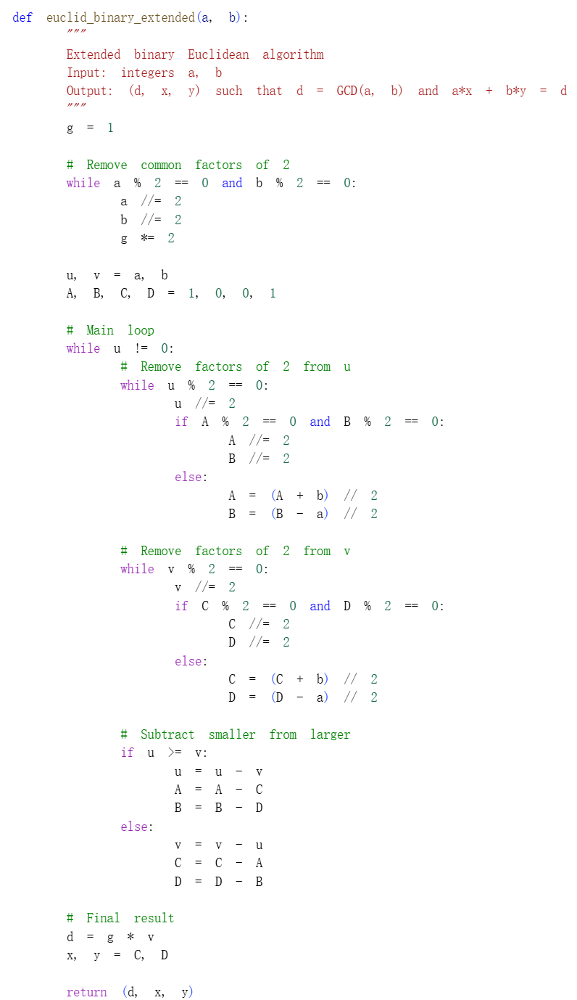

# Цель работы

## Основная цель

В данной лабораторной работе я реализовал четыре алгоритма нахождения наибольшего общего делителя: классический алгоритм Евклида, бинарный алгоритм Евклида, а также их расширенные версии. Основная цель — изучить принципы работы этих алгоритмов и сравнить их эффективность.

# Реализация алгоритмов

## Алгоритм 1: Алгоритм Евклида

Классический алгоритм Евклида основан на последовательном делении с остатком. В цикле большее число заменяется остатком от деления на меньшее до тех пор, пока одно из чисел не станет равным нулю.

### Код реализации

## Алгоритм 2: Бинарный алгоритм Евклида

Бинарный алгоритм использует свойства чётности чисел и заменяет операцию деления на более быстрые операции сдвига и вычитания, что делает его эффективнее для компьютерной реализации.

### Код реализации

## Алгоритм 3: Расширенный алгоритм Евклида

Расширенный алгоритм Евклида позволяет не только найти НОД, но и вычислить коэффициенты $x$ и $y$ из соотношения Безу: $ax + by = d$, где $d = НОД(a, b)$.

### Код реализации

## Алгоритм 4: Расширенный бинарный алгоритм Евклида

Данный алгоритм объединяет преимущества бинарного алгоритма с возможностью нахождения коэффициентов линейной комбинации без использования операции деления.

### Код реализации

# Тестирование всех алгоритмов

Для проверки корректности работы всех алгоритмов были использованы тестовые примеры из задания. Программа выводит результаты каждого алгоритма и проверяет их соответствие.

На представленных результатах видно, что для всех тестовых пар чисел (12345,24690), (12345,54321), (12345,12541), (91,105) и (999,99) все четыре алгоритма дают одинаковые значения НОД. Для каждой пары также приведены коэффициенты соотношения Безу, полученные с помощью расширенных алгоритмов, и выполнена проверка: $a \cdot x + b \cdot y = d$.

# Вывод

В ходе лабораторной работы я успешно реализовал четыре алгоритма нахождения наибольшего общего делителя. Эксперимент подтвердил, что классический алгоритм Евклида наиболее прост в реализации, бинарный алгоритм эффективнее на низком уровне за счёт использования сдвигов, а расширенные алгоритмы позволяют находить коэффициенты линейной комбинации, что важно для решения диофантовых уравнений и криптографических приложений.