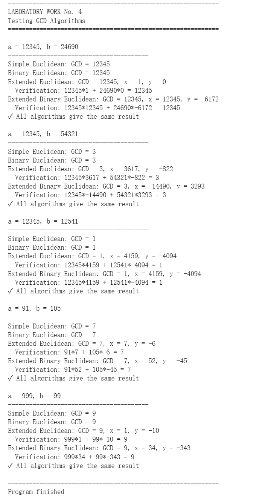

---
## Front matter
title: "Отчёт по лабораторной работе №4"
subtitle: "Математические основы защиты информации и информационной безопасности"
author: "Сунь Маосин"

## Generic otions
lang: ru-RU
toc-title: "Содержание"

## Pdf output format
toc: true
toc-depth: 2
lof: true
lot: true
fontsize: 12pt
linestretch: 1.5
papersize: a4
documentclass: scrreprt
## I18n polyglossia
polyglossia-lang:
  name: russian
  options:
    - spelling=modern
    - babelshorthands=true
polyglossia-otherlangs:
  name: english
## I18n babel
babel-lang: russian
babel-otherlangs: english
## Fonts
mainfont: Times New Roman
romanfont: Times New Roman
sansfont: Arial
monofont: Courier New
mathfont: Times New Roman
mainfontoptions: Ligatures=Common,Ligatures=TeX,Scale=0.94
romanfontoptions: Ligatures=Common,Ligatures=TeX,Scale=0.94
sansfontoptions: Ligatures=Common,Ligatures=TeX,Scale=MatchLowercase,Scale=0.94
monofontoptions: Scale=MatchLowercase,Scale=0.94,FakeStretch=0.9
mathfontoptions:
## Biblatex
biblatex: true
biblio-style: "gost-numeric"
biblatexoptions:
  - parentracker=true
  - backend=biber
  - hyperref=auto
  - language=auto
  - autolang=other*
  - citestyle=gost-numeric
## Pandoc-crossref LaTeX customization
figureTitle: "Рис."
tableTitle: "Таблица"
listingTitle: "Листинг"
lofTitle: "Список иллюстраций"
lotTitle: "Список таблиц"
lolTitle: "Листинги"
## Misc options
indent: true
header-includes:
  - \usepackage{indentfirst}
  - \usepackage{float}
  - \floatplacement{figure}{H}
---

# Цель работы

Изучить принципы различных алгоритмов поиска наибольшего общего делителя (НОД), включая классический алгоритм Евклида, бинарный алгоритм Евклида, а также их расширенные версии. Реализовать данные алгоритмы программно на языке Python и проверить их корректность на примерах из задания.

# Реализация алгоритмов

## Алгоритм Евклида

Классический алгоритм Евклида основан на последовательном делении с остатком. На каждом шаге большее число заменяется остатком от деления на меньшее, пока одно из чисел не станет равным нулю.

### Код реализации

## Бинарный алгоритм Евклида

Бинарный алгоритм использует свойства чётности чисел и заменяет операцию деления на более быстрые операции сдвига и вычитания, что делает его эффективнее для компьютерной реализации.

### Код реализации

## Расширенный алгоритм Евклида

Расширенный алгоритм Евклида позволяет не только найти НОД, но и вычислить коэффициенты $x$ и $y$ из соотношения Безу: $ax + by = d$, где $d = НОД(a, b)$.

### Код реализации

## Расширенный бинарный алгоритм Евклида

Данный алгоритм объединяет преимущества бинарного алгоритма с возможностью нахождения коэффициентов линейной комбинации без использования операции деления.

### Код реализации

# Тестирование всех алгоритмов

Для проверки корректности работы всех алгоритмов были использованы тестовые примеры из задания. Программа выводит результаты каждого алгоритма и проверяет их соответствие.

На представленных результатах видно, что для всех тестовых пар чисел (12345,24690), (12345,54321), (12345,12541), (91,105) и (999,99) все четыре алгоритма дают одинаковые значения НОД. Для каждой пары также приведены коэффициенты соотношения Безу, полученные с помощью расширенных алгоритмов, и выполнена проверка: $a \cdot x + b \cdot y = d$.

# Вывод

В ходе лабораторной работы были реализованы четыре алгоритма нахождения наибольшего общего делителя: классический алгоритм Евклида, бинарный алгоритм, а также их расширенные версии. Все алгоритмы успешно протестированы на примерах из задания и работают корректно. Расширенные алгоритмы позволяют находить коэффициенты линейной комбинации, что имеет важное значение для решения диофантовых уравнений и криптографических приложений.