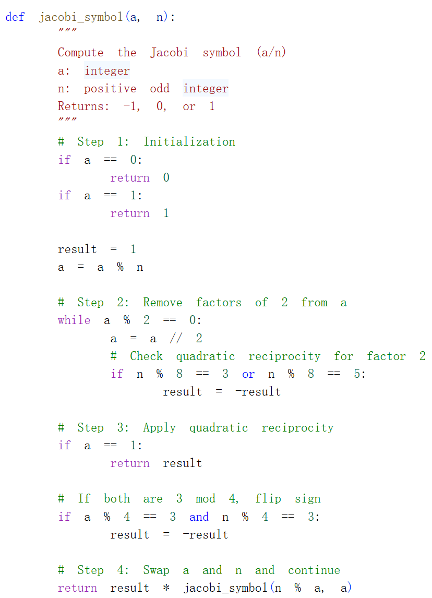
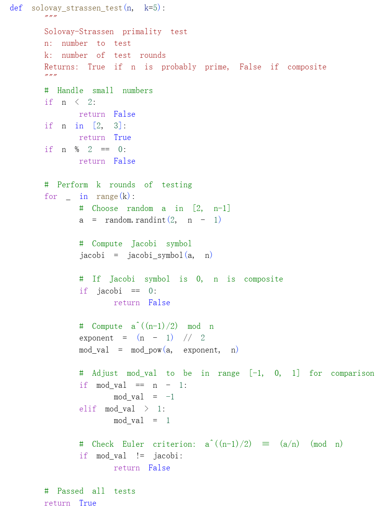
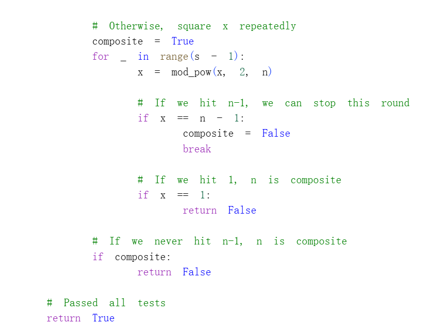

# Цель работы

## Основная цель

В данной лабораторной работе я реализовал на языке Python три вероятностных алгоритма проверки чисел на простоту: тест Ферма, тест Соловэя-Штрассена и тест Миллера-Рабина. Для работы теста Соловэя-Штрассена был также реализован алгоритм вычисления символа Якоби.

# Реализация алгоритмов

## Вспомогательная функция быстрого возведения в степень

Для эффективного вычисления больших степеней по модулю была реализована функция `mod_pow`, использующая бинарный метод возведения в степень. Эта функция используется во всех трёх тестах.

### Код функции

## Тест Ферма

Тест Ферма основан на малой теореме Ферма: для простого числа $p$ выполняется $a^{p-1} \equiv 1 \pmod p$ для любого $a$, не кратного $p$.

### Код реализации

## Алгоритм вычисления символа Якоби

Символ Якоби является обобщением символа Лежандра и необходим для теста Соловэя-Штрассена. Алгоритм использует свойства квадратичной взаимности и рекурсивно вычисляет значение символа.

### Код реализации

## Тест Соловэя-Штрассена

Тест Соловэя-Штрассена основан на критерии Эйлера: для простого числа $p$ выполняется $a^{(p-1)/2} \equiv \left(\frac{a}{p}\right) \pmod p$, где $\left(\frac{a}{p}\right)$ — символ Лежандра.

### Код реализации

## Тест Миллера-Рабина

Тест Миллера-Рабина является наиболее эффективным вероятностным тестом простоты. Он основан на том, что для простого числа $p$ при представлении $p-1 = 2^s \cdot d$ (где $d$ нечётно) выполняется либо $a^d \equiv 1 \pmod p$, либо $a^{2^r d} \equiv -1 \pmod p$ для некоторого $0 \le r < s$.

### Код реализации

# Тестирование алгоритмов

Для проверки корректности работы всех алгоритмов была создана функция `test_all_algorithms`, которая тестирует каждый алгоритм на наборе чисел, включая простые числа, составные числа и числа Кармайкла.

# Итоги работы

## Вывод

В ходе лабораторной работы были реализованы три вероятностных алгоритма проверки чисел на простоту. Экспериментально подтверждено, что тест Ферма может давать ложноположительные результаты на числах Кармайкла (2465, 6601, 8911), в то время как тесты Соловэя-Штрассена и Миллера-Рабина являются более надёжными. Точность всех тестов повышается с увеличением количества раундов тестирования, а вероятность ошибки не превышает $1/2^t$.