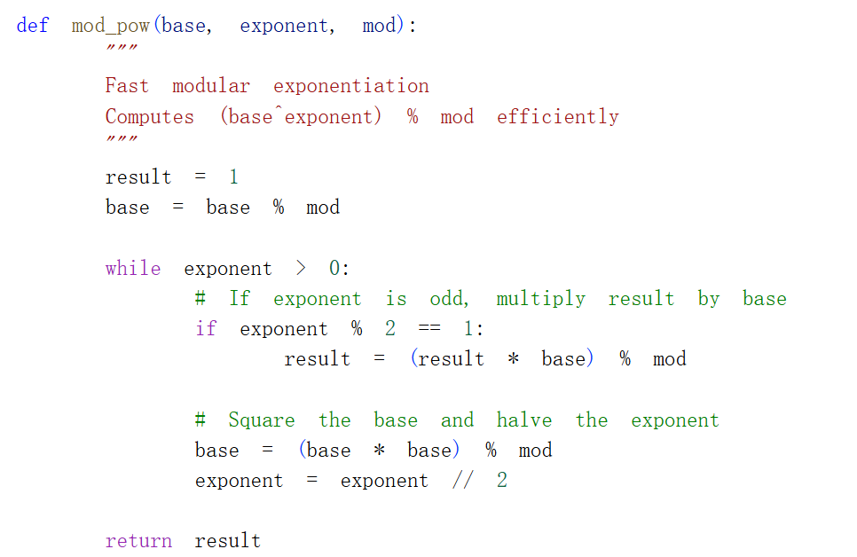
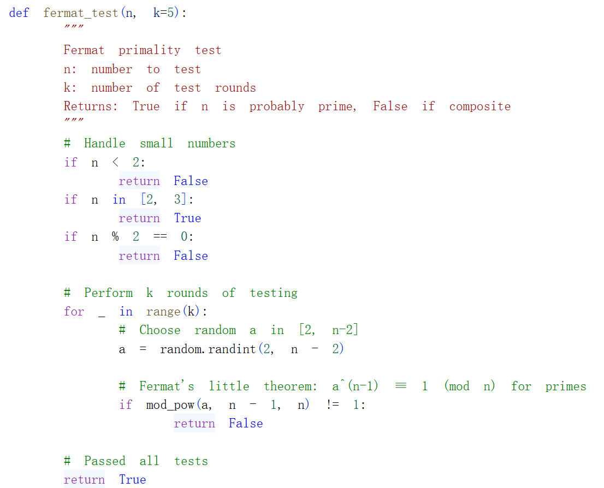
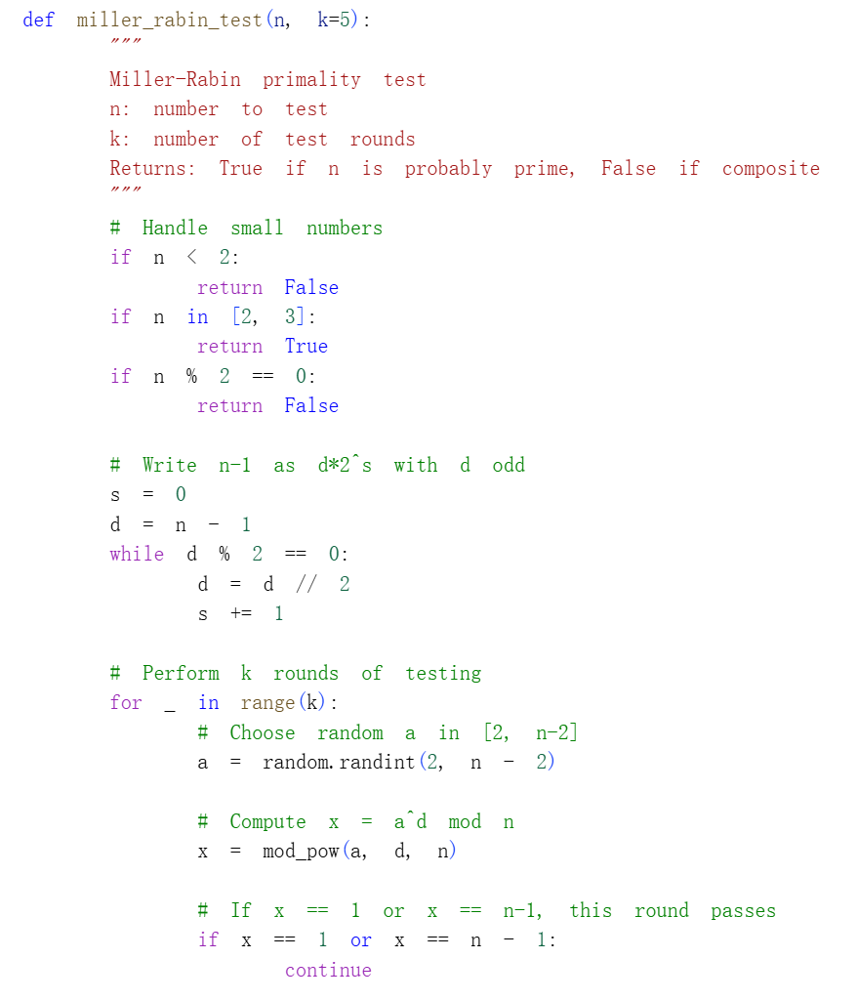
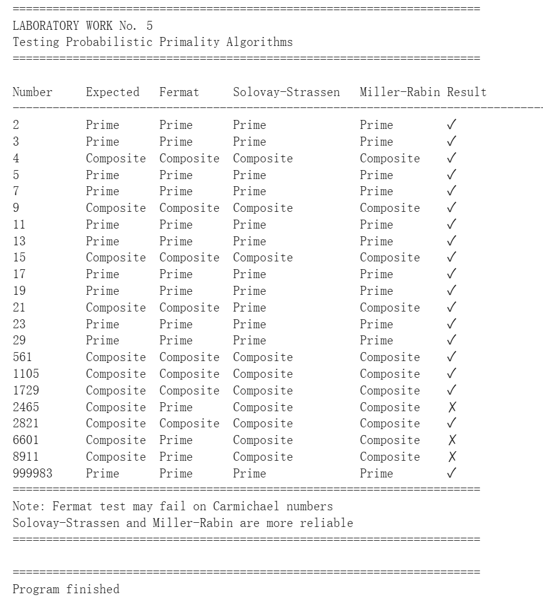

---
## Front matter
title: "Отчёт по лабораторной работе №5"
subtitle: "Математические основы защиты информации и информационной безопасности"
author: "Сунь Маосин"

## Generic otions
lang: ru-RU
toc-title: "Содержание"

## Pdf output format
toc: true
toc-depth: 2
lof: true
lot: true
fontsize: 12pt
linestretch: 1.5
papersize: a4
documentclass: scrreprt
## I18n polyglossia
polyglossia-lang:
  name: russian
  options:
    - spelling=modern
    - babelshorthands=true
polyglossia-otherlangs:
  name: english
## I18n babel
babel-lang: russian
babel-otherlangs: english
## Fonts
mainfont: Times New Roman
romanfont: Times New Roman
sansfont: Arial
monofont: Courier New
mathfont: Times New Roman
mainfontoptions: Ligatures=Common,Ligatures=TeX,Scale=0.94
romanfontoptions: Ligatures=Common,Ligatures=TeX,Scale=0.94
sansfontoptions: Ligatures=Common,Ligatures=TeX,Scale=MatchLowercase,Scale=0.94
monofontoptions: Scale=MatchLowercase,Scale=0.94,FakeStretch=0.9
mathfontoptions:
## Biblatex
biblatex: true
biblio-style: "gost-numeric"
biblatexoptions:
  - parentracker=true
  - backend=biber
  - hyperref=auto
  - language=auto
  - autolang=other*
  - citestyle=gost-numeric
## Pandoc-crossref LaTeX customization
figureTitle: "Рис."
tableTitle: "Таблица"
listingTitle: "Листинг"
lofTitle: "Список иллюстраций"
lotTitle: "Список таблиц"
lolTitle: "Листинги"
## Misc options
indent: true
header-includes:
  - \usepackage{indentfirst}
  - \usepackage{float}
  - \floatplacement{figure}{H}
---

# Цель работы

Изучить и освоить вероятностные алгоритмы проверки чисел на простоту, широко используемые в криптографии. Реализовать программно тесты Ферма, Соловэя-Штрассена и Миллера-Рабина, а также понять их основные принципы и вероятность ошибки.

# Реализация алгоритмов

## Вспомогательная функция быстрого возведения в степень

Для эффективного вычисления больших степеней по модулю была реализована функция `mod_pow`, использующая бинарный метод возведения в степень.

### Код функции

## Тест Ферма

Тест Ферма основан на малой теореме Ферма: для простого числа $p$ выполняется $a^{p-1} \equiv 1 \pmod p$ для любого $a$, не кратного $p$. Если для выбранного случайного $a$ это условие не выполняется, число гарантированно составное.

### Код реализации

## Алгоритм вычисления символа Якоби

Символ Якоби является обобщением символа Лежандра и необходим для теста Соловэя-Штрассена. Алгоритм использует свойства квадратичной взаимности для рекурсивного вычисления.

### Код реализации

## Тест Соловэя-Штрассена

Тест Соловэя-Штрассена основан на критерии Эйлера: для простого числа $p$ выполняется $a^{(p-1)/2} \equiv (\frac{a}{p}) \pmod p$, где $(\frac{a}{p})$ — символ Лежандра. В тесте используется символ Якоби для проверки этого условия.

### Код реализации

## Тест Миллера-Рабина

Тест Миллера-Рабина является наиболее эффективным вероятностным тестом простоты. Он основан на том, что для простого числа $p$ при представлении $p-1 = 2^s \cdot d$ (где $d$ нечетно) для любого $a$ выполняется либо $a^d \equiv 1 \pmod p$, либо $a^{2^r d} \equiv -1 \pmod p$ для некоторого $0 \le r < s$.

### Код реализации

# Тестирование алгоритмов

Для проверки работы алгоритмов была создана функция `test_all_algorithms`, которая тестирует все три алгоритма на наборе чисел, включая простые числа, составные числа и числа Кармайкла.

### Результаты тестирования

Из результатов видно, что:
- Тест Ферма может ошибаться на числах Кармайкла (например, 2465, 6601, 8911)
- Тесты Соловэя-Штрассена и Миллера-Рабина правильно определяют все числа
- Все три алгоритма правильно работают на малых числах

# Вывод

В ходе лабораторной работы были реализованы три вероятностных алгоритма проверки чисел на простоту: тест Ферма, тест Соловэя-Штрассена и тест Миллера-Рабина. Экспериментально подтверждено, что тест Ферма может давать ложноположительные результаты на числах Кармайкла, в то время как тесты Соловэя-Штрассена и Миллера-Рабина являются более надежными. Точность всех тестов повышается с увеличением количества раундов тестирования.