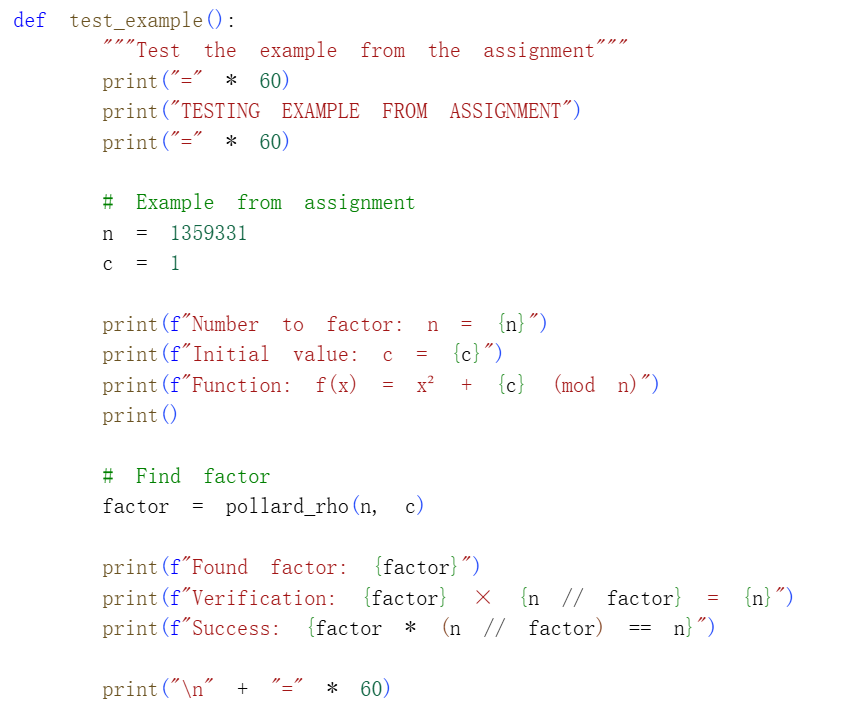
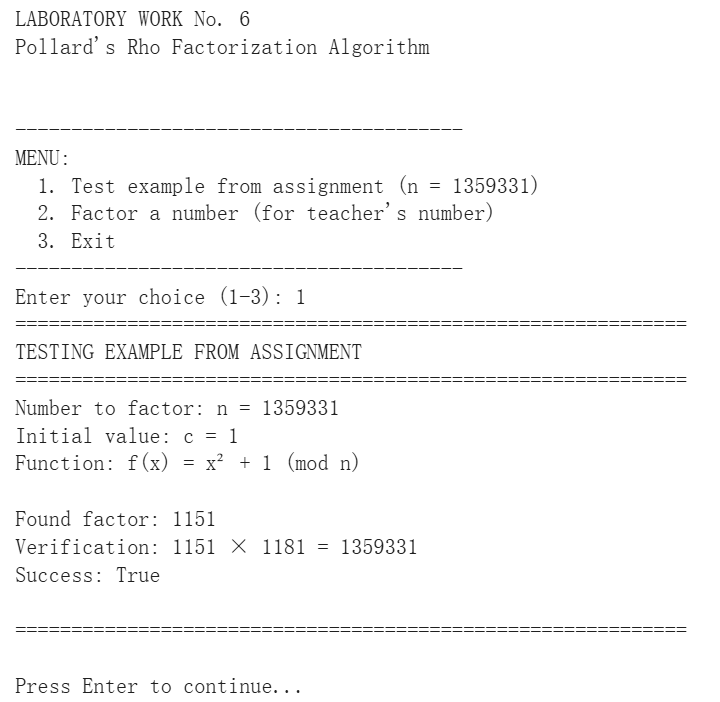
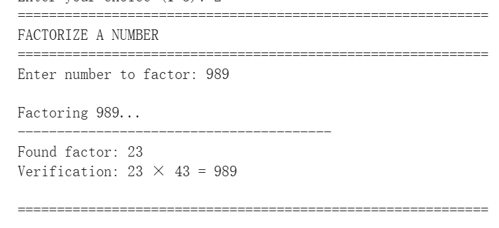

# Цель работы

## Основная цель

В данной лабораторной работе я реализовал ρ-метод Полларда для решения задачи факторизации целых чисел. Основная цель — программная реализация алгоритма поиска нетривиального делителя составного числа и его тестирование на примере из задания.

# Реализация алгоритма

## Вспомогательная функция для вычисления НОД

Для работы алгоритма потребовалась функция вычисления наибольшего общего делителя, реализованная с помощью классического алгоритма Евклида.

### Код функции

---

## ρ-метод Полларда (часть 1)

ρ-метод Полларда — это рандомизированный алгоритм факторизации, основанный на «парадоксе дней рождения» и использующий сжимающие свойства случайных отображений для поиска циклов.

### Код реализации (начало)

---

## ρ-метод Полларда (часть 2)

Ключевой элемент алгоритма — сжимающая функция f(x) = x² + c mod n, которая генерирует псевдослучайную последовательность. Для обнаружения цикла используется метод «быстрого и медленного указателей».

### Код реализации (продолжение)

---

## Тестирование на примере из задания

Для проверки корректности работы алгоритма был использован пример из задания: число n = 1359331 с параметром c = 1 и функцией f(x) = x² + 1 mod n.

### Код тестирования

---

## Результаты выполнения

### Пример из задания

Программа успешно нашла делитель 1151. Проверка: 1151 × 1181 = 1359331.

### Пример с пользовательским числом

Для демонстрации работы алгоритма на других числах был протестирован пример с числом 989 = 23 × 43.

# Итоги работы

## Вывод

В ходе лабораторной работы был успешно реализован ρ-метод Полларда. Для числа n = 1359331 программа нашла делитель 1151, что подтверждает корректность реализации. Алгоритм эффективно использует коллизии в псевдослучайных последовательностях для решения задачи факторизации и является важным инструментом криптоанализа.