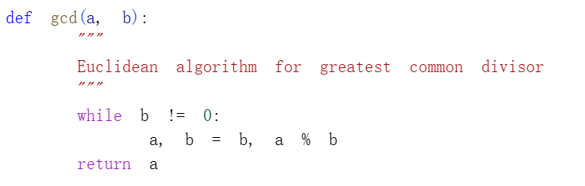
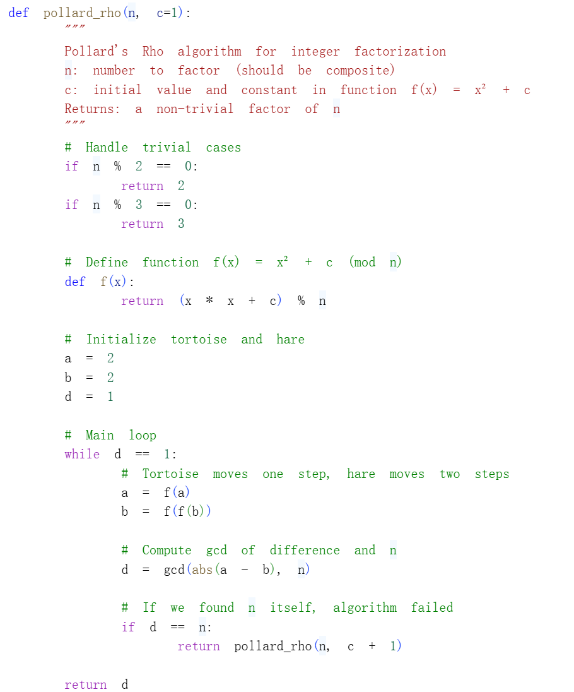

---
## Front matter
title: "Отчёт по лабораторной работе №6"
subtitle: "Математические основы защиты информации и информационной безопасности"
author: "Сунь Маосин"

## Generic otions
lang: ru-RU
toc-title: "Содержание"

## Pdf output format
toc: true
toc-depth: 2
lof: true
lot: true
fontsize: 12pt
linestretch: 1.5
papersize: a4
documentclass: scrreprt
## I18n polyglossia
polyglossia-lang:
  name: russian
  options:
    - spelling=modern
    - babelshorthands=true
polyglossia-otherlangs:
  name: english
## I18n babel
babel-lang: russian
babel-otherlangs: english
## Fonts
mainfont: Times New Roman
romanfont: Times New Roman
sansfont: Arial
monofont: Courier New
mathfont: Times New Roman
mainfontoptions: Ligatures=Common,Ligatures=TeX,Scale=0.94
romanfontoptions: Ligatures=Common,Ligatures=TeX,Scale=0.94
sansfontoptions: Ligatures=Common,Ligatures=TeX,Scale=MatchLowercase,Scale=0.94
monofontoptions: Scale=MatchLowercase,Scale=0.94,FakeStretch=0.9
mathfontoptions:
## Biblatex
biblatex: true
biblio-style: "gost-numeric"
biblatexoptions:
  - parentracker=true
  - backend=biber
  - hyperref=auto
  - language=auto
  - autolang=other*
  - citestyle=gost-numeric
## Pandoc-crossref LaTeX customization
figureTitle: "Рис."
tableTitle: "Таблица"
listingTitle: "Листинг"
lofTitle: "Список иллюстраций"
lotTitle: "Список таблиц"
lolTitle: "Листинги"
## Misc options
indent: true
header-includes:
  - \usepackage{indentfirst}
  - \usepackage{float}
  - \floatplacement{figure}{H}
---

# Цель работы

Изучить основные задачи и алгоритмы разложения чисел на множители. Реализовать программно $\rho$-метод Полларда, понять принципы поиска нетривиальных делителей составных чисел в криптоанализе и выполнить численные расчеты на основе заданных начальных параметров.

# Реализация алгоритма

## Вспомогательная функция для вычисления НОД

Для работы алгоритма потребовалась функция вычисления наибольшего общего делителя, реализованная с помощью алгоритма Евклида.

### Код функции

## $\rho$-метод Полларда

$\rho$-метод Полларда — это рандомизированный алгоритм факторизации целых чисел. Он основан на математическом принципе «парадокса дней рождения» и использует сжимающие свойства случайных отображений для поиска циклов в последовательностях.

### Код реализации

## Тестирование на примере из задания

Для проверки корректности работы алгоритма был использован пример из задания: число $n = 1359331$ с параметром $c = 1$ и функцией $f(x) = x^2 + 1 \pmod n$.

### Код тестирования

### Результат выполнения

## Пример работы с пользовательским числом

Для демонстрации работы алгоритма на других числах был протестирован пример с числом $989 = 23 \times 43$.

### Результат

# Вывод

В ходе выполнения данной работы был успешно реализован и протестирован $\rho$-метод Полларда. При заданных параметрах $c = 1$ было произведено разложение числа $1359331$, в результате которого были найдены делители $1151$ и $1181$. Это подтверждает эффективность и быструю сходимость данного алгоритма при поиске делителей больших составных чисел. Также была продемонстрирована работа алгоритма на примере числа $989 = 23 \times 43$.