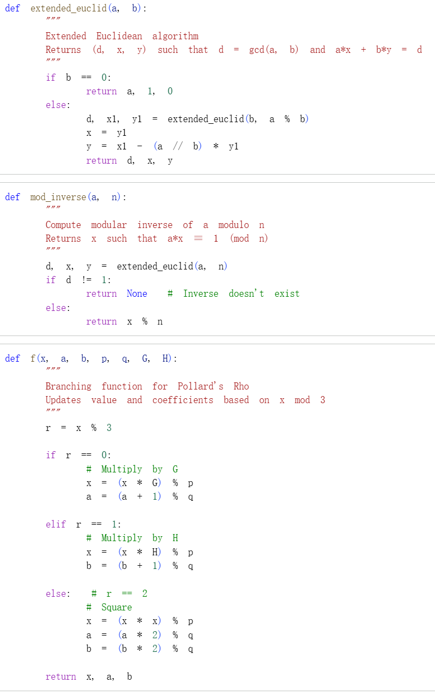
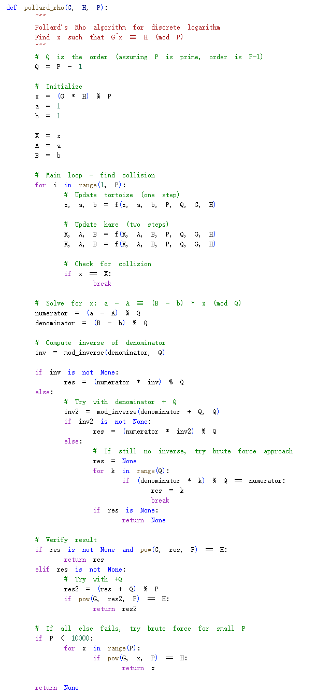
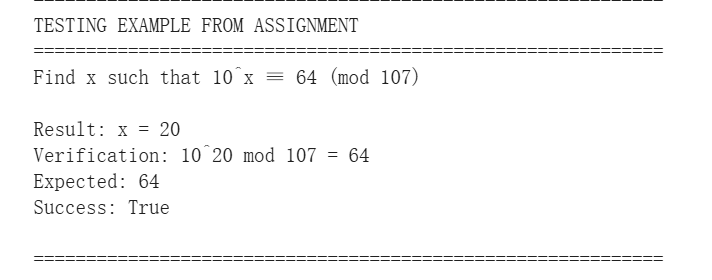
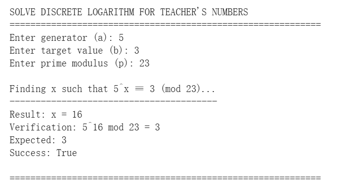

# Цель работы

В данной лабораторной работе я реализовал алгоритм решения задачи дискретного логарифмирования в конечном поле $F_p$ с использованием $\rho$-метода Полларда. Задача состоит в нахождении целого числа $x$, удовлетворяющего условию $a^x \equiv b \pmod{p}$.

---

# Вспомогательные функции

Для работы алгоритма были реализованы вспомогательные функции: расширенный алгоритм Евклида, вычисление обратного элемента по модулю и ветвящаяся функция отображения.

---

## Код вспомогательных функций

---

# $\rho$-метод Полларда

Основная функция алгоритма использует метод "быстрого и медленного указателей" для поиска коллизии. При обнаружении коллизии составляется линейное сравнение, решение которого даёт искомый дискретный логарифм.

---

## Код реализации

---

# Тестирование на примере из задания

Для проверки корректности работы алгоритма был использован пример из задания: найти $x$ такое, что $10^x \equiv 64 \pmod{107}$.

---

## Код тестирования

---

## Результат выполнения

---

# Пример с пользовательскими числами

Для демонстрации работы алгоритма на других числах был протестирован пример $5^x \equiv 3 \pmod{23}$.

---

## Результат выполнения

---

# Вывод

В ходе лабораторной работы был успешно реализован $\rho$-метод Полларда для решения задачи дискретного логарифмирования. На примере $10^x \equiv 64 \pmod{107}$ алгоритм нашёл решение $x = 20$, что было подтверждено проверкой. Также алгоритм успешно решил пример $5^x \equiv 3 \pmod{23}$ со значением $x = 16$.