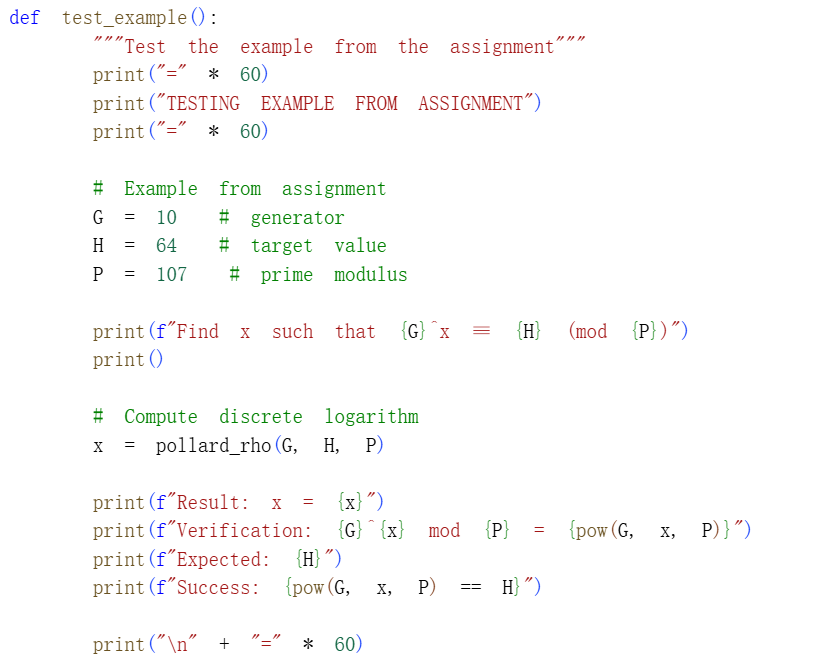

---
## Front matter
title: "Отчёт по лабораторной работе №7"
subtitle: "Математические основы защиты информации и информационной безопасности"
author: "Сунь Маосин"

## Generic otions
lang: ru-RU
toc-title: "Содержание"

## Pdf output format
toc: true
toc-depth: 2
lof: true
lot: true
fontsize: 12pt
linestretch: 1.5
papersize: a4
documentclass: scrreprt
## I18n polyglossia
polyglossia-lang:
  name: russian
  options:
    - spelling=modern
    - babelshorthands=true
polyglossia-otherlangs:
  name: english
## I18n babel
babel-lang: russian
babel-otherlangs: english
## Fonts
mainfont: Times New Roman
romanfont: Times New Roman
sansfont: Arial
monofont: Courier New
mathfont: Times New Roman
mainfontoptions: Ligatures=Common,Ligatures=TeX,Scale=0.94
romanfontoptions: Ligatures=Common,Ligatures=TeX,Scale=0.94
sansfontoptions: Ligatures=Common,Ligatures=TeX,Scale=MatchLowercase,Scale=0.94
monofontoptions: Scale=MatchLowercase,Scale=0.94,FakeStretch=0.9
mathfontoptions:
## Biblatex
biblatex: true
biblio-style: "gost-numeric"
biblatexoptions:
  - parentracker=true
  - backend=biber
  - hyperref=auto
  - language=auto
  - autolang=other*
  - citestyle=gost-numeric
## Pandoc-crossref LaTeX customization
figureTitle: "Рис."
tableTitle: "Таблица"
listingTitle: "Листинг"
lofTitle: "Список иллюстраций"
lotTitle: "Список таблиц"
lolTitle: "Листинги"
## Misc options
indent: true
header-includes:
  - \usepackage{indentfirst}
  - \usepackage{float}
  - \floatplacement{figure}{H}
---

# Цель работы

Изучить задачу дискретного логарифмирования в конечных полях и её применение в криптографии с открытым ключом. Реализовать программно $\rho$-метод Полларда для нахождения показателя $x$ в сравнении $a^x \equiv b \pmod{p}$, понять принципы поиска коллизий и решения линейных сравнений в циклических группах.

# Реализация алгоритма

## Вспомогательные функции

Для работы алгоритма потребовались функции расширенного алгоритма Евклида, вычисления обратного элемента по модулю и ветвящаяся функция для обновления значений.

### Код вспомогательных функций

## $\rho$-метод Полларда для дискретного логарифмирования

Основная функция алгоритма реализует поиск коллизий с помощью метода "черепахи и зайца". При обнаружении коллизии решается линейное сравнение для нахождения искомого логарифма.

### Код реализации

## Тестирование на примере из задания

Для проверки корректности работы алгоритма был использован пример из задания: $10^x \equiv 64 \pmod{107}$.

### Код тестирования

### Результат выполнения

## Пример работы с пользовательскими числами

Для демонстрации работы алгоритма на других числах был протестирован пример $5^x \equiv 3 \pmod{23}$.

### Результат

# Вывод

В ходе выполнения работы был успешно реализован $\rho$-метод Полларда для задачи дискретного логарифмирования. На примере сравнения $10^x \equiv 64 \pmod{107}$ было получено значение $x = 20$, что подтверждает корректность реализации. Также была продемонстрирована работа алгоритма на примере $5^x \equiv 3 \pmod{23}$ с результатом $x = 16$. Алгоритм показал свою эффективность, сводя сложную задачу логарифмирования к поиску коллизий в последовательности и решению линейных сравнений.