---
## Front matter
title: "Отчёт по лабораторной работе №8"
subtitle: "Математические основы защиты информации и информационной безопасности"
author: "Сунь Маосин"

## Generic otions
lang: ru-RU
toc-title: "Содержание"

## Pdf output format
toc: true
toc-depth: 2
lof: true
lot: true
fontsize: 12pt
linestretch: 1.5
papersize: a4
documentclass: scrreprt
## I18n polyglossia
polyglossia-lang:
  name: russian
  options:
    - spelling=modern
    - babelshorthands=true
polyglossia-otherlangs:
  name: english
## I18n babel
babel-lang: russian
babel-otherlangs: english
## Fonts
mainfont: Times New Roman
romanfont: Times New Roman
sansfont: Arial
monofont: Courier New
mathfont: Times New Roman
mainfontoptions: Ligatures=Common,Ligatures=TeX,Scale=0.94
romanfontoptions: Ligatures=Common,Ligatures=TeX,Scale=0.94
sansfontoptions: Ligatures=Common,Ligatures=TeX,Scale=MatchLowercase,Scale=0.94
monofontoptions: Scale=MatchLowercase,Scale=0.94,FakeStretch=0.9
mathfontoptions:
## Biblatex
biblatex: true
biblio-style: "gost-numeric"
biblatexoptions:
  - parentracker=true
  - backend=biber
  - hyperref=auto
  - language=auto
  - autolang=other*
  - citestyle=gost-numeric
## Pandoc-crossref LaTeX customization
figureTitle: "Рис."
tableTitle: "Таблица"
listingTitle: "Листинг"
lofTitle: "Список иллюстраций"
lotTitle: "Список таблиц"
lolTitle: "Листинги"
## Misc options
indent: true
header-includes:
  - \usepackage{indentfirst}
  - \usepackage{float}
  - \floatplacement{figure}{H}
---

# Цель работы

Изучить и реализовать основные алгоритмы целочисленной арифметики многократной точности. Целью работы является освоение методов выполнения арифметических операций (сложение, вычитание, умножение и деление) над числами, разрядность которых превышает стандартные типы данных ЭВМ, с использованием позиционной системы счисления с основанием $b = 10$.

# Реализация алгоритмов

## Вспомогательные функции преобразования

Для работы с числами как с массивами цифр были реализованы функции преобразования строк в списки цифр и обратно.

### Код функций

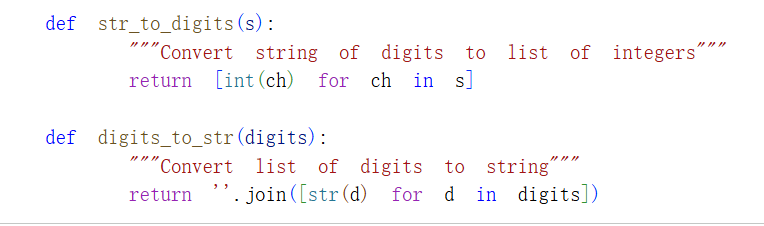

## Сложение неотрицательных целых чисел

Алгоритм имитирует ручное сложение столбиком. Процесс начинается с младших разрядов и включает перенос $k$ в старшие разряды.

### Код реализации

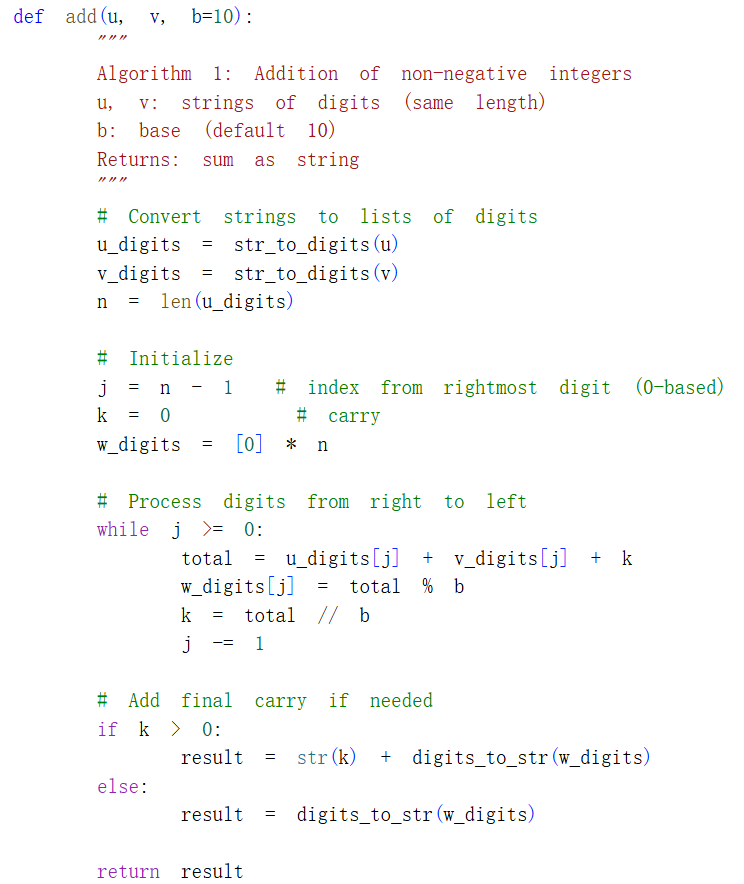

### Результат выполнения

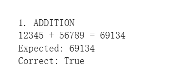

## Вычитание неотрицательных целых чисел

Алгоритм реализует операцию $u - v$ при условии $u > v$. Переменная $k$ используется для фиксации займа из старшего разряда.

### Код реализации

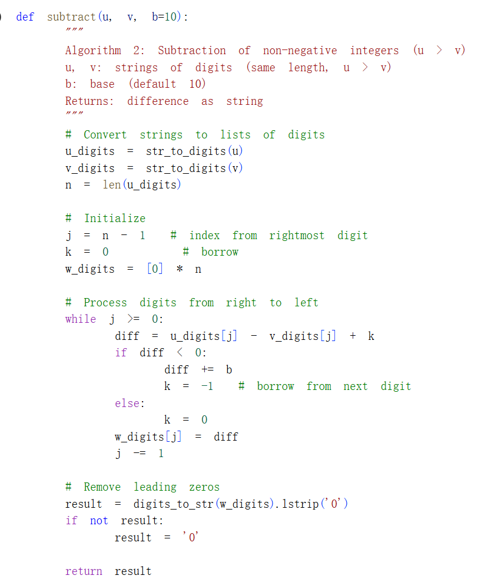

### Результат выполнения

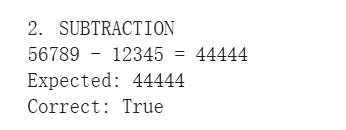

## Умножение столбиком

Классический метод умножения, где каждый разряд множителя $v$ последовательно умножается на все разряды множимого $u$ с последующим суммированием результатов со сдвигом.

### Код реализации

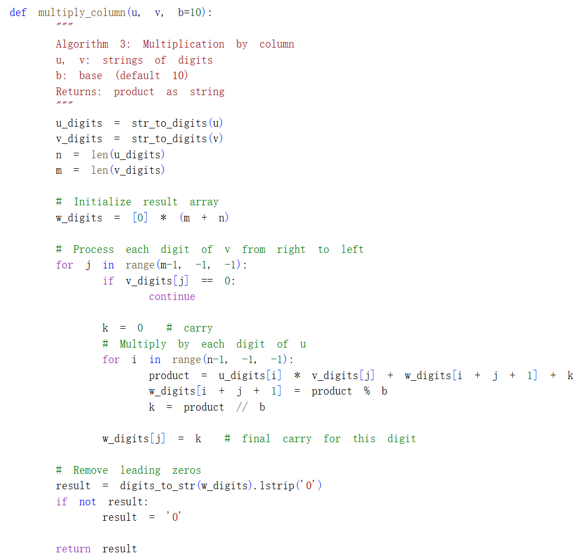

### Результат выполнения

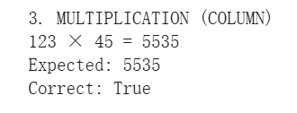

## Быстрый столбик

Оптимизированный алгоритм умножения, использующий один аккумулятор $t$ для вычисления суммы вкладов всех пар разрядов в конкретную позицию результата.

### Код реализации

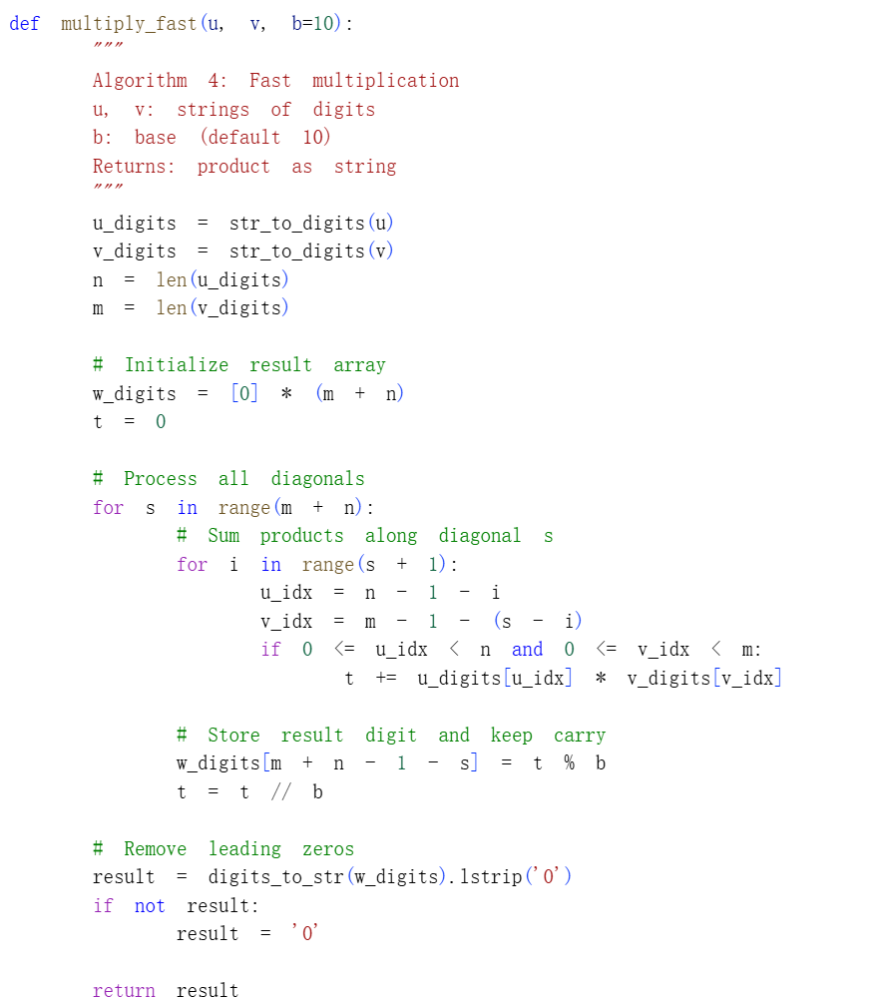

### Результат выполнения

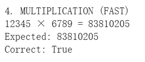

## Деление многоразрядных чисел

Алгоритм деления реализован методом длинного деления (Long division). Он последовательно обрабатывает цифры делимого, формируя цифры частного и вычисляя остаток.

### Код реализации

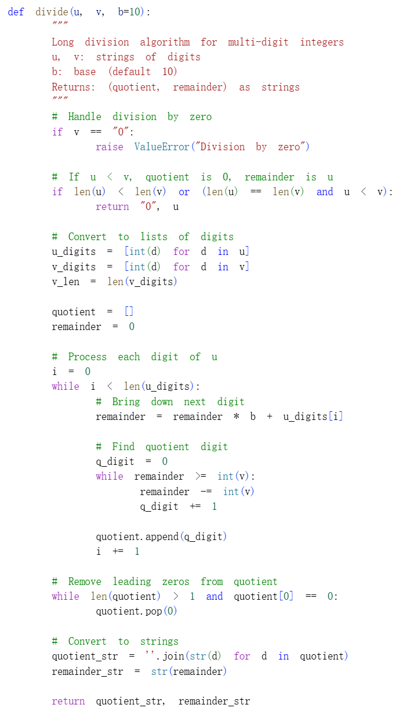

### Результат выполнения

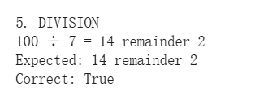

## Тестирование всех алгоритмов

Для проверки корректности работы всех алгоритмов была создана функция `test_algorithms`, которая тестирует каждый алгоритм на примерах.

### Код тестирования

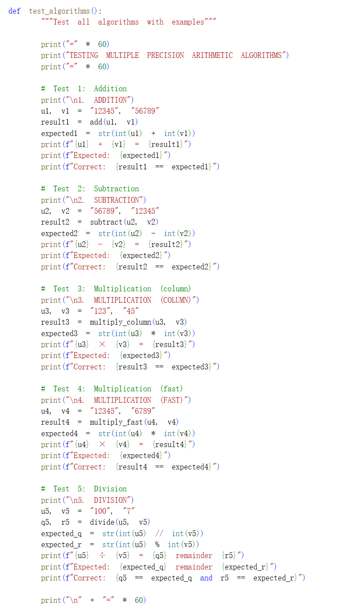

### Полные результаты тестирования

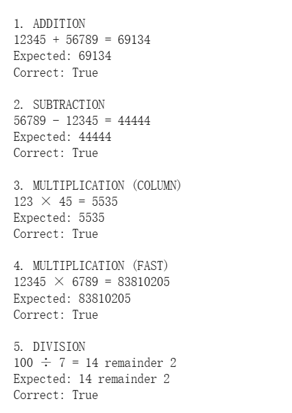

# Вывод

В ходе работы были программно реализованы ключевые операции арифметики многократной точности: сложение, вычитание, умножение (классическое и быстрое) и деление. Все алгоритмы успешно протестированы на примерах и работают корректно. Для проверки деления был использован пример $100 \div 7 = 14$ (остаток $2$), что подтверждает правильность реализации. Разработанные алгоритмы могут быть использованы для работы с числами произвольной длины, что является важным для криптографических приложений.